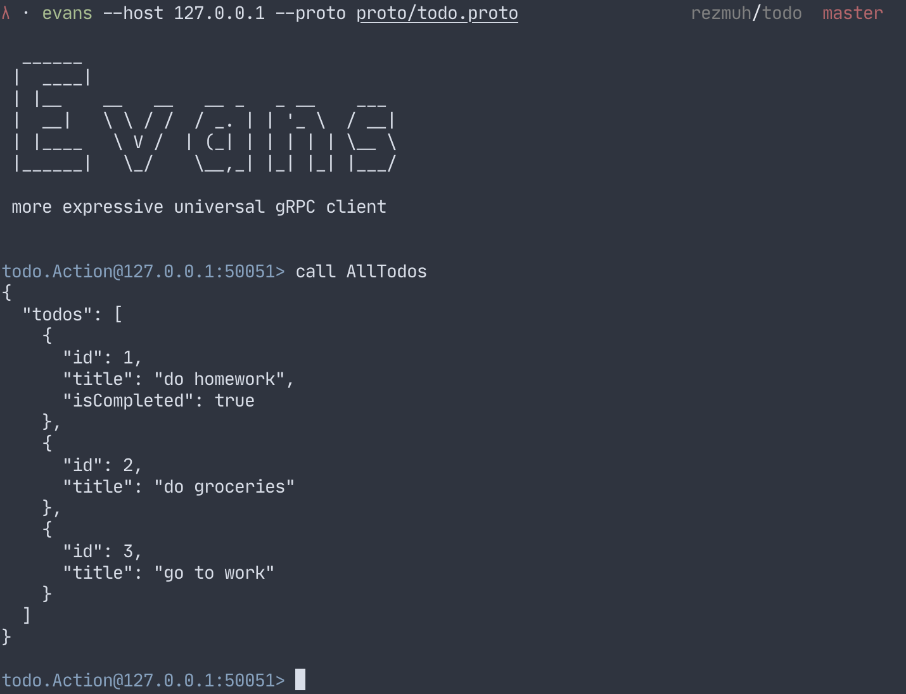

# GRPC Server with Rust, tonic, sqlx, refinery and barrel

This repository is an example of how I setup a GRPC server in Rust. The components include:

 - Tonic [Tonic](https://github.com/hyperium/tonic) as the GRPC server framework
 - [SQLx](https://github.com/launchbadge/sqlx) as SQL toolkit. I chose to use this as it supports asynchronous operations, has a built-in mapper between Rust Struct and database tables as well as a built-in connection pooler.
 - [refinery](https://github.com/rust-db/refinery) is used to setup database migrations
 - [barrel](https://github.com/rust-db/barrel) allows me to create database migration scripts in Rust.

# Services

This service exposes 4 RPC calls:

- `AddTodo`  to create a todo item
- `AllTodos` to list all todo items
- `Incomplete` to list all incomplete todo items
- `GetTodo` to get a detail of a todo item
- `MarkComplete` to mark a todo item as completed

## Running the Binaries

This repository has two binaries:

 - `todo` (which can be run from `cargo run --bin todo`) is the main GRPC server
 - `migrate` (which can be run from `cargo run --bin migrate`) is the binary to execute database migrations

If you're building this, please set your environment configuration from `.env` file (copied from `.env.example`). Then you can run `cargo run --bin migrate` to create the table. Finally, you can then run `cargo run --bin todo` to run GRPC server.

## Testing from Client

I've been using [evans](https://github.com/ktr0731/evans) as a GRPC client to test for the service. Use the following command to connect:

```
evans --host 127.0.0.1 --proto proto/todo.proto
```

To call any of the RPCs listed above, you can just use `call` command (e.g `call AddTodo`)

## Screenshot


